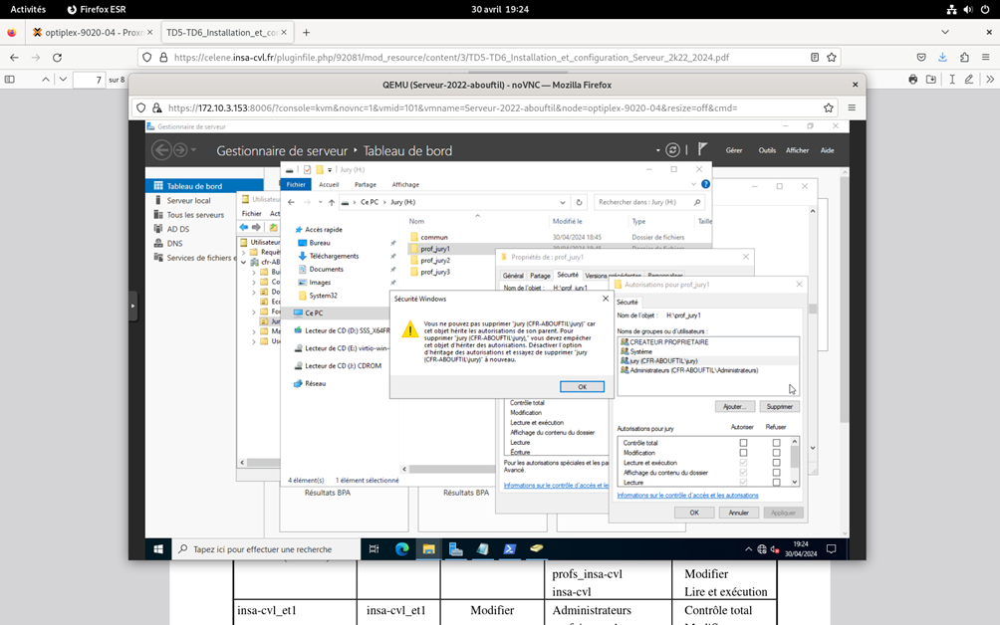
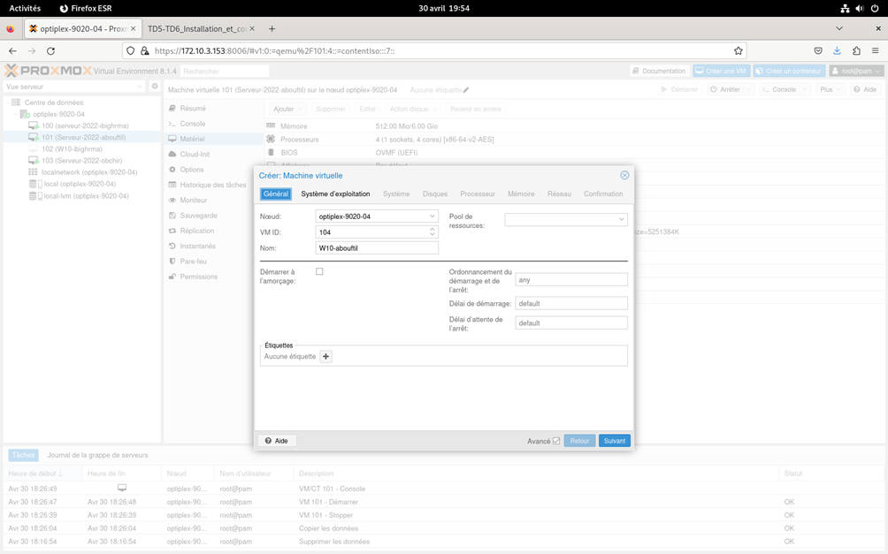
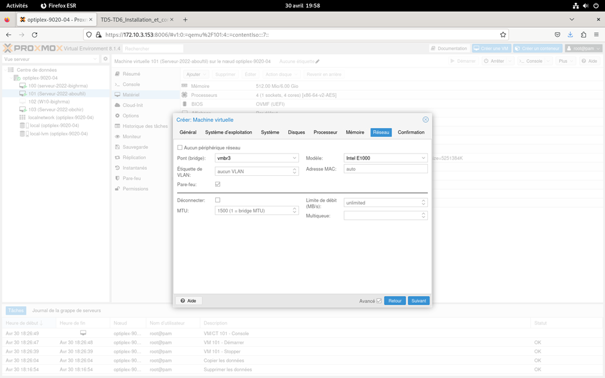
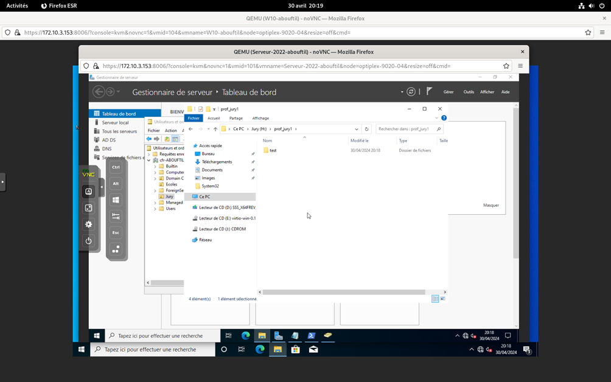

# Active Directory Windows Server 2022

Dans le cadre de ce TP, nous avons mis en pratique les éléments de théorie vus en cours en mettant en place un serveur Windows 2022 pour la gestion en réseau des ressources informatiques de la Coupe de France de Robotique. Notre mission était de créer un environnement réseau pour connecter les participants de chaque école et gérer les ressources informatiques.

## Table des matières

- [Préparation des machines virtuelles de la maquette](#preparation-des-machines-virtuelles-de-la-maquette)
- [Installation du Serveur](#installation-du-serveur)
- [Création et administration des comptes](#création-et-administration-des-comptes)
- [Sécurisation des données](#sécurisation-des-données)
- [Script de connexion/login](#script-de-connexionlogin)

## Préparation des machines virtuelles de la maquette

Pour créer la machine virtuelle "serveur" avec les caractéristiques spécifiées, suivez les étapes suivantes :

1. Ouvrez votre interface web du serveur Proxmox à l'aide de l'adresse IP communiquée. Ici, nous utiliserons IP = <span style="color:blue;text-decoration:underline;">172.10.3.153:8006</span>.  

  

Cliquez sur "Nouvelle machine virtuelle" pour commencer le processus de création.

2. Dans l'assistant de création, donnez un nom à la machine virtuelle, par exemple "Serveur-2022-NomLogin". Nous utiliserons ici <span style="color:blue;text-decoration:underline;">Serveur-2022-abouftil</span>.  


3. Ajoutez l'ISO de Windows Server 2022 pour le système d'exploitation.  


4. Ajoutez un premier disque dur IDE de 32 Gio (le second disque dur SCSI de 40 Gio sera ajouté plus tard).  


5. Sélectionnez "1" comme support de processeur avec 4 cœurs.  


6. Définissez la mémoire vive (RAM) sur "4 Go" avec un minimum de RAM de 512 MB.  


7. Attachez une carte réseau au réseau virtuel "vmbrx", où "x" représente le numéro du groupe de TD. Nous utiliserons ici <span style="color:blue;text-decoration:underline;">vmbr3</span>.  


Une fois que vous avez terminé de configurer ces paramètres, nous pouvons lancer la machine virtuelle du serveur. <strong><span style="color:red;text-decoration:underline;">ATTENTION</span></strong><span style="color:red;text-decoration:underline;font-type:strong"> : Lorsque vous lancerez votre machine virtuelle, veuillez taper rapidement sur une touche pour lancer le support d'installation Windows</span>.

## Installation du Serveur
1. Choisissez Windows Server 2022 Standard (expérience de Bureau)  


2. Évidemment, effectuez une installation personnalisée. Ici, c'est notre première installation.  

  

Choisissez comme mot de passe administrateur : <span style="color:blue;text-decoration:underline;">Azerty18</span>

3. Veillez à modifier le nom de la machine locale. Pour cela, rendez-vous sur ``Paramètre``>``Système``>``À propos de``>``Renommer ce PC``. Nous utiliserons ici <span style="color:blue;text-decoration:underline;">SRV-2K22-ABOUFTIL</span>.  


4. Veillez également à changer l'adresse IP. Pour cela, rendez-vous sur ``Panneau de configuration``>``Réseau et Internet``>``Centre Réseau et partage``>``Modifier les paramètres de la carte``.  

  

Cliquez sur ``Propriétés`` et désactivez le protocole Internet IPv6. Rendez-vous dans les propriétés du protocole Internet IPv4 et entrez l'adresse IP suivante : 192.168.x.10. N'oubliez pas de cocher "Valider les paramètres en quittant".
La valeur "x" correspond au numéro de votre TD. Nous utiliserons ici <span style="color:blue;text-decoration:underline;">192.168.3.10</span>.  

  

Redémarrez pour appliquez les changements.
Nous allons maintenant créer notre contrôleur de domaine.

###### Installation du Rôle DNS & ADDS

Pour installer un contrôleur de domaine, deux rôles sont indispensables : Le rôle DNS et ADDS.

1. Depuis le Gestionnaire de serveur, cliquez sur l’étape Gérer puis Ajouter des rôles et fonctionnalités.  


2. Sélectionnez le type d’installation « Installation basée sur un rôle ou une fonctionnalité ».  


3. Pour le moment, il n'y a qu'un seul serveur, donc cliquer sur Suivant.  


4. Vous êtes maintenant sur la fenêtre de sélection des rôles, pour que ADDS fonctionne, il est indispensable d’avoir un serveur DNS. Nous allons donc installer les rôles DNS + ADDS. Pour cela, cochez simplement DNS puis ADDS dans la fenêtre de sélection des rôles. Enfin, cliquez sur Suivant.  


Des fonctionnalités supplémentaires sont automatiquement sélectionnées pour vous, ajoutez-les.

5. Après avoir ajouté des rôles, vous pouvez ajouter des fonctionnalités supplémentaires. En général, toutes les caractéristiques qui sont nécessaires pour le rôle cible sont déjà sélectionnées ainsi vous pouvez simplement cliquer sur le bouton ``Suivant`` pour continuer.  


6. Dans la dernière fenêtre, vous trouverez un récapitulatif de ce que vous allez installer sur votre serveur. Vous avez la possibilité de redémarrer automatiquement le serveur, cependant dans cette étape ce n’est pas nécessaire, le serveur n’a pas besoin de redémarrer. Si tout vous semble OK, alors cliquez sur ``Installer``.  


L’installation des rôles et fonctionnalités vont se lancer… Cela prendra quelques minutes. Vous pouvez fermer la fenêtre en cliquant sur ``Fermer``.

7. Revenez maintenant sur le Dashboard du Server Manager, vous devriez y trouver une petite alerte (Si elle n'apparaît pas, cliquer sur le symbole de rafraîchsissement juste à côté.).
Cliquez dessus, puis cliquez sur « Promouvoir ce serveur en contrôleur de domaine ».  


8. Ici, nous allons créer un nouveau domaine et donc une nouvelle forêt. Dans mon cas, je nommerai mon domaine <span style="color:blue;text-decoration:underline;">cfr-ABOUFTIL.fr</span>.  


9. Vous devrez également choisir un mot de passe. Cliquez sur ``Suivant`` pour continuer.  


10. Normalement, dans cette fenêtre, vous pouvez créer une délégation DNS, ici, nous n’avons pas d’autres serveurs DNS dans ce domaine, il est donc logique d'avoir cet avertissement. Cliquez sur ``Suivant`` pour continuer.  


11. Le NetBIOS sera automatiquement créé, vous pouvez le changer si nécessaire. Cliquez sur ``Suivant`` pour continuer.  


12. Dans la dernière fenêtre, vous trouverez un récapitulatif de ce que vous allez installer sur votre serveur.  

  

Il est également possible d’afficher le script PowerShell pour par exemple l’enregistrer et l’utiliser sur une prochaine installation (ainsi vous gagnerez beaucoup de temps).  


Si tout est OK, vous pouvez alors cliquer sur ``Suivant``.

13. Nous y voilà, vous avez quelques avertissements, mais c’est tout à fait normal, rien d’inquiétant. Cliquez sur Installer pour enfin lancer l’installation du contrôleur de domaine. L’installation est lancée, il y en a pour quelques minutes.  


14. Un redémarrage sera nécessaire.  


Le serveur a redémarré, et on voit déjà la différence, vous êtes maintenant authentifié sur votre domaine. Tapez votre mot de passe administrateur.

15. Maintenant que votre serveur est promu comme Contrôleur de Domaine, vous devriez voir les rôles ADDS & DNS sur le Gestionnaire de serveur. Si vous regardez dans les outils, on retrouve tout ce qui touche à ADDS et au serveur DNS.
<p align="center">
    
</p>

16. En utilisant l’outil Utilisateurs et ordinateurs Active Directory (dsa.msc) vous devriez trouver votre serveur dans l’OU (Unité d’Organisation) Domain Controllers.  


Vous avez créé un contrôleur de domaine, vous pouvez maintenant créer vos OU, utilisateurs et faire joindre vos PCs au domaine.

###### Installation du disque dur et du pilote virtio-win

Pour optimiser les performances de notre serveur, nous allons installer un disque dur supplémentaire et le pilote virtio-win. Le pilote virtio-win améliore les performances de l'entrée/sortie du disque dur et du réseau dans les machines virtuelles.

<strong><span style="color:red;text-decoration:underline;">ATTENTION</span></strong><span style="color:red;text-decoration:underline;"> : Lorsque vous allez ajouter le disque dur et le pilote, veillez à ce que votre machine virtuelle soit éteinte</span>.

1. Ajoutez un disque dur SCSI de 40 Gio à votre machine virtuelle via l'interface de gestion de Proxmox.  


2. Montez l'image ISO du pilote virtio-win que vous avez téléchargée comme un lecteur de CD/DVD dans votre machine virtuelle.  

  

3. Dans votre machine virtuelle, suivez les instructions à l'écran pour installer le pilote virtio-win.  


4. Nous allons maintenant pouvoir partitionner le disque dur du serveur suivant la table ci-dessous :

<div align="center">

| Disque | Nom Partition | Taille    |
|--------|-------------|-------------|
| IDE    | System      | 32 Gio      |        
| SCSI   | Appli       | 5 Gio       |        
| SCSI   | Users       | 5 Gio       |        
| SCSI   | Sauvegarde  | 10 Gio      |        
| SCSI   | Jury        | 2 Gio       |        
| SCSI   | Ecoles      | 18 Gio      |

</div>

5. Rendez-vous sur le gestionnaire de disque. Vous allez constater que le disque n'est pas reconnu car il n'est pas initialisé. Faites un clic droit et initialisez le disque.  


6. Une fenêtre s'ouvrira pour vous demander le style de partition que vous souhaitez : choisissez GPT.
<p align="center">
    
</p>

7. Pour créer une partition, faites un clic droit et choisissez « Créer un volume simple ».  


Indiquez le nom de la partition, sa taille, ainsi que le système de fichier NTFS.

Vous devez obtenir quelque chose de similaire :  


Nous pouvons dés à présent créer les dossier pour nos utilisateurs. Voici l'arborescence du serveur que vous devais construire.
<p align="center">
    
</p>

Par exemple, pour les Jury, nous avons le dossier commun, et un dossier pour chaque jury.  


Voici un script qui vous permettra de créer toute l'arborescence : 

```powershell
New-Item -ItemType Directory -Path "F:\profiles"
New-Item -ItemType Directory -Path "H:\commun"
New-Item -ItemType Directory -Path "H:\prof_jury1"
New-Item -ItemType Directory -Path "H:\prof_jury2"
New-Item -ItemType Directory -Path "H:\prof_jury3"
New-Item -ItemType Directory -Path "I:\insa-cvl"
New-Item -ItemType Directory -Path "I:\insa-lyon"
New-Item -ItemType Directory -Path "I:\profs_ecoles"
New-Item -ItemType Directory -Path "I:\profs_ecoles\commun"
New-Item -ItemType Directory -Path "I:\profs_ecoles\prof_insa-cvl"
New-Item -ItemType Directory -Path "I:\profs_ecoles\prof_insa-lyon"
New-Item -ItemType Directory -Path "I:\profs_ecoles\prof_insa-supelec-paris"
New-Item -ItemType Directory -Path "I:\profs_ecoles\prof_utc-comp"
New-Item -ItemType Directory -Path "I:\supelec-paris"
New-Item -ItemType Directory -Path "I:\utc-comp"
New-Item -ItemType Directory -Path "I:\insa-cvl\commun"
New-Item -ItemType Directory -Path "I:\insa-cvl\insa-cvl_et1"
New-Item -ItemType Directory -Path "I:\insa-cvl\insa-cvl_et2"
New-Item -ItemType Directory -Path "I:\insa-lyon\commun"
New-Item -ItemType Directory -Path "I:\insa-lyon\insa-lyon_et1"
New-Item -ItemType Directory -Path "I:\insa-lyon\insa-lyon_et2"
New-Item -ItemType Directory -Path "I:\supelec-paris\commun"
New-Item -ItemType Directory -Path "I:\supelec-paris\supelec-paris_et1"
New-Item -ItemType Directory -Path "I:\supelec-paris\supelec-paris_et2"
New-Item -ItemType Directory -Path "I:\utc-comp\commun"
New-Item -ItemType Directory -Path "I:\utc-comp\utc-comp_et1"
New-Item -ItemType Directory -Path "I:\utc-comp\utc-comp_et2"
```

## Création et administration des comptes

Nous allons maintenant créer notre utilisateurs et leur déterminé certains paramètres.
Pour cela :

1. Créer 2 unités d’organisation (Ecoles et Jury) dans le domaine racine.  


Vous pouvez également le faire de cette manière via powershell.

```powershell
$nameserve="ABOUFTIL"
New-ADOrganizationalUnit -Name "Ecoles" -Path "DC=cfr-$nameserve,DC=fr"
New-ADOrganizationalUnit -Name "Jury" -Path "DC=cfr-$nameserve,DC=fr"
```
Vous devez obtenir quelque chose comme ça :  


2. Créer les différents groupes d'utilisateurs suivants :

<div align="center">

| Nom Groupe     | Description                                       |
|----------------|---------------------------------------------------|
| jury           | Membres du jury                                   |
| profs_ecoles   | Professeurs des écoles                            |
| insa-cvl       | Professeurs et étudiants de l’INSA-CVL            |
| insa-lyon      | Professeurs et étudiants de l’INSA de Lyon        |
| supelec-paris  | Professeurs et étudiants de CentraleSupélec Paris-Saclay |
| utc-comp       | Professeurs et étudiants de l’UTC de Compiègne    |

</div>

Pour cela, créer un nouvel objet Groupe (ici nous allons prendre le cas de Jury) :  

  

Adressez lui un nom de groupe, un étendue globale du groupe de type sécurité.  

Vous pouvez créer vos groupes à l'aide de ce script :
```powershell
New-ADGroup -Name "jury" -GroupScope Global -Description "Membres du jury" -Path "OU=Jury,DC=cfr-$nameserve,DC=fr"
New-ADGroup -Name "profs_ecoles" -GroupScope Global -Description "Professeurs des écoles" -Path "OU=Ecoles,DC=cfr-$nameserve,DC=fr"
New-ADGroup -Name "insa-cvl" -GroupScope Global -Description "Professeurs et étudiants de l’INSA-CVL" -Path "OU=Ecoles,DC=cfr-$nameserve,DC=fr"
New-ADGroup -Name "insa-lyon" -GroupScope Global -Description "Professeurs et étudiants de l’INSA de Lyon" -Path "OU=Ecoles,DC=cfr-$nameserve,DC=fr"
New-ADGroup -Name "supelec-paris" -GroupScope Global -Description "Professeurs et étudiants de CentraleSupélec Paris-Saclay" -Path "OU=Ecoles,DC=cfr-$nameserve,DC=fr"
New-ADGroup -Name "utc-comp" -GroupScope Global -Description "Professeurs et étudiants de l’UTC de Compiègne" -Path "OU=Ecoles,DC=cfr-$nameserve,DC=fr"
```

Nous allons à présent créer des utilisateurs. Dans notre cas, nous souhaitons qu'ils n'aient pas de mot de passe. Nous allons désactiver la saisie obligatoire de mot de passe.

<strong><span style="color:black;text-decoration:underline;">Remarque</span></strong><span style="color:black;text-decoration:underline;"> : cela ne doit jamais être appliqué dans un contexte d’entreprise !</span>.

Pour désactiver la saisie de mot de passe, rendez-vous dans Exécuter et saisissez  « gpmc.msc ».
Dans le gestionnaire de stratégie de groupe, rendez-vous dans ``Domaines``>`cfr-NomLogin.fr`>``Objets de stratégie de groupe``>``Default Domain Policy`` et cliquez sur ``Modifier``.  


Dans l'éditeur de gestion des stratégies de groupe rendez-vous dans Configuration ordinateur>Stratégies>Paramètres Windows>Paramètre de sécurité>Stratégies de comptes>Stratégie de mot de passe et désactiver la stratégie « le mot de passe doit respecter des exigences de complexité » ainsi que la stratégie « Longueur minimale du mot de passe » à 0 caractères.  


Mettons à jour les stratégies avec : ``gpupdate /force`` dans powershell.  


3. Créer un nouvel objet de type Utilisateurs (ici nous prenons l'exemple de ``prof_jury1``). Adressez lui un Nom et un Nom d'ouverture de session de l'utilisateur.  


4. Ne mettez aucun mot de passe et selectionner "le mot de passe n'expire jamais".

<strong><span style="color:black;text-decoration:underline;">Rappel</span></strong><span style="color:black;text-decoration:underline;"> : cela ne doit jamais être appliqué dans un contexte d’entreprise !</span>.

5. L'utilisateur `prof_jury1` a été créer. Maintenant, ajoutons le dans le groupe Administrateur et Jury. Pour cela, rendez-vous dans ``Propriétés``>``Membre de``.  

  

Selectionner `Ajouter` et entrez `Jury` par exemple.  


Créer tous les utilisateurs suivants :
| Utilisateur     | Groupes                            | Horaires                       |
|-----------------|------------------------------------|--------------------------------|
| prof_jury1      | Administrateurs, jury              | aucune limitation              |
| prof_jury2      | Opérateurs de serveur, Opérateurs d’impression, Opérateurs de sauvegarde, jury | du jeudi au samedi de 6h00 à 23h00 |
| prof_jury3      | Opérateurs d’impression, jury       | du jeudi au samedi de 6h00 à 23h00 |
| prof_insa-cvl   | profs_ecoles, insa-cvl             | du jeudi au samedi de 6h00 à 23h00 |
| insa-cvl_et1    | insa-cvl                           | vendredi 7h00-23h00, samedi 7h00-18h00 |
| insa-cvl_et2    | insa-cvl                           | vendredi 7h00-23h00, samedi 7h00-18h00 |
| prof_insa-lyon  | profs_ecoles, insa-lyon            | du jeudi au samedi de 6h00 à 23h00 |
| insa-lyon_et1   | insa-lyon                          | vendredi 7h00-23h00, samedi 7h00-18h00 |
| insa-lyon_et2   | insa-lyon                          | vendredi 7h00-23h00, samedi 7h00-18h00 |
| prof_supelecparis | profs_ecoles, supelec-paris        | du jeudi au samedi de 6h00 à 23h00 |
| supelecparis_et1 | supelec-paris                      | vendredi 7h00-23h00, samedi 7h00-18h00 |
| supelecparis_et2 | supelec-paris                      | vendredi 7h00-23h00, samedi 7h00-18h00 |
| prof_utc-comp   | profs_ecoles, utc-comp             | du jeudi au samedi de 6h00 à 23h00 |
| utc-comp_et1    | utc-comp                           | vendredi 7h00-23h00, samedi 7h00-18h00 |
| utc-comp_et2    | utc-comp                           | vendredi 7h00-23h00, samedi 7h00-18h00 |

Voici un script qui vous permettra de créer tous les utilisateurs :

```powershell
$utilisateurs = @(
    @{ Nom = "prof_jury1"; Groupes = "Administrateurs,jury" },
    @{ Nom = "prof_jury2"; Groupes = "Opérateurs de serveur,jury" },
    @{ Nom = "prof_jury3"; Groupes = "jury" },
    @{ Nom = "prof_insa-cvl"; Groupes = "profs_ecoles,insa-cvl" },
    @{ Nom = "insa-cvl_et1"; Groupes = "insa-cvl" },
    @{ Nom = "insa-cvl_et2"; Groupes = "insa-cvl" },
    @{ Nom = "prof_insa-lyon"; Groupes = "profs_ecoles,insa-lyon" },
    @{ Nom = "insa-lyon_et1"; Groupes = "insa-lyon" },
    @{ Nom = "insa-lyon_et2"; Groupes = "insa-lyon" },
    @{ Nom = "prof_supelec-paris"; Groupes = "profs_ecoles,supelec-paris" },
    @{ Nom = "supelec-paris_et1"; Groupes = "supelec-paris" },
    @{ Nom = "supelec-paris_et2"; Groupes = "supelec-paris" },
    @{ Nom = "prof_utc-comp"; Groupes = "profs_ecoles,utc-comp" },
    @{ Nom = "utc-comp_et1"; Groupes = "utc-comp" },
    @{ Nom = "utc-comp_et2"; Groupes = "utc-comp" }
)


foreach ($utilisateur in $utilisateurs) {
    try {
        $path = if ($utilisateur.Groupes -like "*jury*") {
            "OU=Jury,DC=cfr-$nameserve,DC=fr"
        } else {
            "OU=Ecoles,DC=cfr-$nameserve,DC=fr"
        }

        # Créer l'utilisateur avec les paramètres spécifiques
        New-ADUser -Name $utilisateur.Nom -Path $path -UserPrincipalName "$($utilisateur.Nom)@cfr-$nameserve.fr" -GivenName $utilisateur.Nom -Surname $utilisateur.Nom -SamAccountName $utilisateur.Nom -DisplayName $utilisateur.Nom -Enabled $true -PasswordNeverExpires $true -ErrorAction Stop

        # Ajouter l'utilisateur à chaque groupe
        $groupes = $utilisateur.Groupes -split ","
        foreach ($groupe in $groupes) {
            # Vérifier si le groupe est un groupe intégré
            if ($groupe.Trim() -in @("Opérateurs de serveur", "Opérateurs de sauvegarde", "Administrateurs")) {
                Add-ADGroupMember -Identity "CN=$groupe, CN=Builtin, DC=cfr-$nameserve,DC=fr" -Members $utilisateur.Nom -ErrorAction Stop
            } else {
                Add-ADGroupMember -Identity $groupe.Trim() -Members $utilisateur.Nom -ErrorAction Stop
            }
        }
    } catch {
        Write-Error "Une erreur s'est produite lors de la création de l'utilisateur ou de l'ajout de l'utilisateur au groupe : $_"
    }
}
```

Vous devez obtenir quelque chose comme cela :  


6. Vous remarquez que `prof_jury1` n'a aucune limitation contrairement à `prof_jury2`. Regardons comment imposer un horaire à un utilisateur.
Rendez-vous dans `Propriétés`>`Compte`>`Horaire d'accés` et indiquez les horaires souhaitez.  


Evidemment, je vous fournis un script permettant d'automatiser vos horaires. Le voici : 

```powershell
$log = (Get-ADUser -Identity prof_jury2 -Properties logonHours).logonHours
Set-ADUser -Identity prof_jury3 -Replace @{logonHours = $log} 
Set-ADUser -Identity prof_insa-cvl -Replace @{logonHours = $log}
Set-ADUser -Identity prof_insa-lyon -Replace @{logonHours = $log}
Set-ADUser -Identity prof_supelec-paris -Replace @{logonHours = $log}
Set-ADUser -Identity prof_utc-comp -Replace @{logonHours = $log}

$log = (Get-ADUser -Identity insa-cvl_et1 -Properties logonHours).logonHours
Set-ADUser -Identity insa-cvl_et2 -Replace @{logonHours = $log}
Set-ADUser -Identity insa-lyon_et1 -Replace @{logonHours = $log}
Set-ADUser -Identity insa-lyon_et2 -Replace @{logonHours = $log}
Set-ADUser -Identity supelec-paris_et1 -Replace @{logonHours = $log}
Set-ADUser -Identity supelec-paris_et2 -Replace @{logonHours = $log}
Set-ADUser -Identity utc-comp_et1 -Replace @{logonHours = $log}
Set-ADUser -Identity utc-comp_et2 -Replace @{logonHours = $log}
```
Vous devez au moins faire manuellement `prof_jury2` et `insa-cvl_et1`.

7. Nous allons maintenant définir le profil d’environnement de l’utilisateur. Pour cela, Partageons les répertoires suivants :

<div align="center">
    
| Répertoire      | Nom de partage   |
|-----------------|------------------|
| profiles        | profiles$        |
| jury            | jury$            |
| profs_ecoles    | profs_ecoles$    |
| insa-cvl        | insa-cvl$        |
| insa-lyon       | insa-lyon$       |
| supelec-paris   | supelec-paris$   |
| utc-comp        | utc-comp$        |

</div>

Prenons un exemple :
Nous souhaitons partager le repertoire jury. Clic droit sur le repertoire puis `Propriétés`>`Partage`>`Partage avancé`.  


Partager le dossier et adressez lui son nom de partage. Vous pouvez également limiter le nombre d'utilisateurs simultanés.  

Allons dans ``Autorisations`` et ajoutons le groupe `jury`.  


Voici le script vous permettant de réaliser ces tâches :

```powershell
net share jury$=H:\ /grant:jury,READ /grant:jury,CHANGE /users:5
net share profiles$=F:\profiles /users:5
net share profs_ecoles$=I:\profs_ecoles /grant:profs_ecoles,READ /grant:profs_ecoles,CHANGE /users:5
net share insa-cvl$=I:\insa-cvl /grant:insa-cvl,READ /grant:insa-cvl,CHANGE /users:5
net share insa-lyon$=I:\insa-lyon /grant:insa-lyon,READ /grant:insa-lyon,CHANGE /users:5
net share supelec-paris$=I:\supelec-paris /grant:supelec-paris,READ /grant:supelec-paris,CHANGE /users:5
net share utc-comp$=I:\utc-comp /grant:utc-comp,READ /grant:utc-comp,CHANGE /users:5
net share commun_jury$=H:\commun /grant:jury,READ /grant:jury,CHANGE /users:5
net share commun_insa-cvl$=I:\insa-cvl\commun /grant:insa-cvl,READ /grant:insa-cvl,CHANGE /users:5
net share commun_insa-lyon$=I:\insa-lyon\commun /grant:insa-lyon,READ /grant:insa-lyon,CHANGE /users:5
net share commun_supelec-paris$=I:\supelec-paris\commun /grant:supelec-paris,READ /grant:supelec-paris,CHANGE /users:5
net share commun_utc-comp$=I:\utc-comp\commun /grant:utc-comp,READ /grant:utc-comp,CHANGE /users:5
net share commun_profs_ecoles$=I:\profs_ecoles\commun /grant:profs_ecoles,READ /grant:profs_ecoles,CHANGE /users:5
net share prof_jury1$=H:\prof_jury1 /grant:prof_jury1,READ /grant:prof_jury1,CHANGE /users:1
net share prof_jury2$=H:\prof_jury2 /grant:prof_jury2,READ /grant:prof_jury2,CHANGE /users:1
net share prof_jury3$=H:\prof_jury3 /grant:prof_jury3,READ /grant:prof_jury3,CHANGE /users:1
net share prof_insa-cvl$=I:\profs_ecoles\prof_insa-cvl /grant:prof_insa-cvl,READ /grant:prof_insa-cvl,CHANGE /users:1
net share insa-cvl_et1$=I:\insa-cvl\insa-cvl_et1 /grant:insa-cvl_et1,READ /grant:insa-cvl_et1,CHANGE /users:1
net share insa-cvl_et2$=I:\insa-cvl\insa-cvl_et2 /grant:insa-cvl_et2,READ /grant:insa-cvl_et2,CHANGE /users:1
net share insa-lyon_et1$=I:\insa-lyon\insa-lyon_et1 /grant:insa-lyon_et1,READ /grant:insa-lyon_et1,CHANGE /users:1
net share insa-lyon_et2$=I:\insa-lyon\insa-lyon_et2 /grant:insa-lyon_et2,READ /grant:insa-lyon_et2,CHANGE /users:1
net share supelec-paris_et1$=I:\supelec-paris\supelec-paris_et1 /grant:supelec-paris_et1,READ /grant:supelec-paris_et1,CHANGE /users:1
net share supelec-paris_et2$=I:\supelec-paris\supelec-paris_et2 /grant:supelec-paris_et2,READ /grant:supelec-paris_et2,CHANGE /users:1
net share utc-comp_et1$=I:\utc-comp\utc-comp_et1 /grant:utc-comp_et1,READ /grant:utc-comp_et1,CHANGE /users:1
net share utc-comp_et2$=I:\utc-comp\utc-comp_et2 /grant:utc-comp_et2,READ /grant:utc-comp_et2,CHANGE /users:1
```

8. Pour chaque utilisateur, nous devons définir le chemin du profil.
Rendez-vous dans `Propriétés`>`Profil` et dans la section `Chemin du profil`, inserez le profil suivant : à `\\SRV-2K22-NomLogin\profiles$\%USERNAME%.`

`%USERNAME%` est une variable qui sera remplacé par le nom de l'utilisateur.


Voici le script permettant d'automatiser ces opérations :

```powershell
$serverPath = "\\SRV-2K22-ABOUFTIL"

Set-ADUser -Identity prof_jury1 -ProfilePath "$serverPath\profiles$\prof_jury1"
Set-ADUser -Identity prof_jury2 -ProfilePath "$serverPath\profiles$\prof_jury2"
Set-ADUser -Identity prof_insa-cvl -ProfilePath "$serverPath\profiles$\prof_insa-cvl"
Set-ADUser -Identity prof_insa-lyon -ProfilePath "$serverPath\profiles$\prof_insa-lyon"
Set-ADUser -Identity prof_supelec-paris -ProfilePath "$serverPath\profiles$\prof_supelec-paris"
Set-ADUser -Identity prof_utc-comp -ProfilePath "$serverPath\profiles$\prof_utc-comp"
Set-ADUser -Identity insa-cvl_et2 -ProfilePath "$serverPath\profiles$\insa-cvl_et2"
Set-ADUser -Identity insa-lyon_et1 -ProfilePath "$serverPath\profiles$\insa-lyon_et1"
Set-ADUser -Identity insa-lyon_et2 -ProfilePath "$serverPath\profiles$\insa-lyon_et2"
Set-ADUser -Identity supelec-paris_et1 -ProfilePath "$serverPath\profiles$\supelec-paris_et1"
Set-ADUser -Identity supelec-paris_et2 -ProfilePath "$serverPath\profiles$\supelec-paris_et2"
Set-ADUser -Identity utc-comp_et1 -ProfilePath "$serverPath\profiles$\utc-comp_et1"
Set-ADUser -Identity utc-comp_et2 -ProfilePath "$serverPath\profiles$\utc-comp_et2"
```

9. Adressez également un dossier de base à chaque utilisateur. Dans notre exemple `prof_jury1`, choissiez la section `Connecter` à la lettre de montage K par exemple à `\\SRV-2K22-NomLogin\jury$\%USERNAME%.`  


Voici les repertoires de bases qui doivent être associés à chaque utilisateurs :

| Utilisateur       | Répertoire de base                           |
|-------------------|----------------------------------------------|
| prof_jury1        | \\Srv-2k22-NomLogin\jury$\%USERNAME%         |
| prof_jury2        | \\Srv-2k22-NomLogin\jury$\%USERNAME%         |
| prof_jury3        | \\Srv-2k22-NomLogin\jury$\%USERNAME%         |
| prof_insa-cvl     | \\Srv-2k22-NomLogin\profs_ecoles$\%USERNAME% |
| prof_insa-lyon    | \\Srv-2k22-NomLogin\profs_ecoles$\%USERNAME% |
| prof_supelec-paris| \\Srv-2k22-NomLogin\profs_ecoles$\%USERNAME% |
| prof_utc-comp     | \\Srv-2k22-NomLogin\profs_ecoles$\%USERNAME% |
| insa-cvl_et1      | \\Srv-2k22-NomLogin\insa-cvl$\%USERNAME%     |
| insa-cvl_et2      | \\Srv-2k22-NomLogin\insa-cvl$\%USERNAME%     |
| insa-lyon_et1     | \\Srv-2k22-NomLogin\insa-lyon$\%USERNAME%    |
| insa-lyon_et2     | \\Srv-2k22-NomLogin\insa-lyon$\%USERNAME%    |
| supelec-paris_et1 | \\Srv-2k22-NomLogin\supelec-paris$\%USERNAME%|
| supelec-paris_et2 | \\Srv-2k22-NomLogin\supelec-paris$\%USERNAME%|
| utc-comp_et1      | \\Srv-2k22-NomLogin\utc-comp$\%USERNAME%     |
| utc-comp_et2      | \\Srv-2k22-NomLogin\utc-comp$\%USERNAME%     |

Pas d'inquiétude, voici le script permettant d'automatiser ces opérations :
```powershell
$serverPath = "\\SRV-2K22-ABOUFTIL"

net user prof_jury1 /homedir:$serverPath\jury$\prof_jury1
net user prof_jury2 /homedir:$serverPath\jury$\prof_jury2
net user prof_jury3 /homedir:$serverPath\jury$\prof_jury3
net user prof_insa-cvl /homedir:$serverPath\profs_ecoles$\prof_insa-cvl
net user prof_insa-lyon /homedir:$serverPath\profs_ecoles$\prof_insa-lyon
net user prof_supelec-paris /homedir:$serverPath\profs_ecoles$\prof_supelec-paris
net user prof_utc-comp /homedir:$serverPath\profs_ecoles$\prof_utc-comp
net user insa-cvl_et1 /homedir:$serverPath\insa-cvl$\insa-cvl_et1
net user insa-cvl_et2 /homedir:$serverPath\insa-cvl$\insa-cvl_et2
net user insa-lyon_et1 /homedir:$serverPath\insa-lyon$\insa-lyon_et1
net user insa-lyon_et2 /homedir:$serverPath\insa-lyon$\insa-lyon_et2
net user supelec-paris_et1 /homedir:$serverPath\supelec-paris$\supelec-paris_et1
net user supelec-paris_et2 /homedir:$serverPath\supelec-paris$\supelec-paris_et2
net user utc-comp_et1 /homedir:$serverPath\utc-comp$\utc-comp_et1
net user utc-comp_et2 /homedir:$serverPath\utc-comp$\utc-comp_et2
```
<strong>Attention !</strong> Ce script écrira dans le ``Chemin d'accés local``. Il ne vous permet que d'avoir la chaîne de caractère juste à vos côtés pour la mettre dans la bonne section.

## Sécurisation des données
Nous avons enfin fini de configurer ces utilisateurs et maintenant nous devons les sécurisés.
Par défaut, les dossiers ou les fichiers ont droits d’accès. Garder les droits ``CREATEUR PROPRIETAIRE``
et ``Système`` par défaut et supprimer les autres.

1. Sécurisons le repertoire Jury. Seul les groupes Administrateurs et jury doivent avoir des droits de `Contrôle total` et de ``Lire et exécuter`` respectivement. Rendez-vous sur le repertoire `Jury` et cliquez sur ``Propriétés``>``Partage``>``Modifier``.
Ajouter le groupe ``Jury`` et donnez lui les droits de ``Lire et exécuter``. Donnez également les droits de `Contrôle total` à l'Administrateur si ce n'est pas déjà fait. Vous devez avoir quelque chose qui ressemble à ceci :  


Et voilà ! Vous avez sécuriser le repertoire. 

<strong>Attention !</strong> Certains sous-dossier que vous partagez heritent des autorisations de leurs parents ! Vous pouvez avoir ce genre d'erreur :  



Pour pouvoir modifier les autorisations du repertoire, revenez à l'onglet `Sécurité` des `Prpriétés` de votre repertoire et aller dans `Avancé`. Vous allez pouvoir désactiver l'heritage :  


<strong>Attention !</strong> Veillez à ce que vous convertissiez les autorisations et à ne pas les supprimer !  


Très bien. Vous avez tous les outils pour faire la suite. Faites de mêmes pour les autres repertoires suivants :

| Partition ou Répertoire | Utilisateurs | Droits d'accès NTFS | Groupe utilisateurs | Droits d'accès NTFS |
|-------------------------|--------------|---------------------|---------------------|---------------------|
| Users                   |              |                     | Administrateurs Utilisa. du domaine | contrôle total Lire et exécution |
| profiles                |              |                     | Administrateurs Utilisa. du domaine | Contrôle total Modifier |
| Ecoles                  |              |                     | Administrateurs jury profs_ecoles | Contrôle total Lire et exécution Lire et exécution |
| Jury                    |              |                     | Administrateurs jury | Contrôle total Lire et exécution |
| commun (jury)           |              |                     | Administrateurs jury | Contrôle total Modifier |
| prof_jury1              | prof_jury1   | Modifier            | Administrateurs | Contrôle total |
| prof_jury2              | prof_jury2   | Modifier            | Administrateurs | Contrôle total |
| prof_jury3              | prof_jury3   | Modifier            | Administrateurs | Contrôle total |
| profs_ecoles            |              |                     | Administrateurs jury profs_ecoles | Contrôle total Modifier Modifier |
| insa-cvl                |              |                     | Administrateurs prof_insa-cvl insa-cvl | Contrôle total Modifier Lire et exécution |
| commun (insa-cvl)       |              |                     | Administrateurs profs_insa-cvl insa-cvl | Contrôle total Modifier Lire et exécution |
| insa-cvl_et1            | insa-cvl_et1 | Modifier            | Administrateurs prof_insa-cvl | Contrôle total Modifier |
| insa-cvl et2            | insa-cvl_et2 | Modifier            | Administrateurs prof_insa-cvl | Contrôle total Modifier |

Et quand vous aurez fini, faites de même en appliquants les droits d’accès NTFS aux répertoires des autres écoles en se basant sur le modèle de l’école INSA-CVL :)

Ca en fait des choses à configurer... Voici votre cadeau surprise :) :

```powershell
# Liste des chemins de fichiers
$paths = @(
    "H:\",
    "F:\",
    "I:\",
    "F:\profiles",
    "H:\commun",
    "H:\prof_jury1",
    "H:\prof_jury2",
    "H:\prof_jury3",
    "I:\profs_ecoles",
    "I:\insa-cvl",
    "I:\insa-cvl\commun",
    "I:\insa-cvl\insa-cvl_et1",
    "I:\insa-cvl\insa-cvl_et2",
    "I:\insa-lyon",
    "I:\insa-lyon\commun",
    "I:\insa-lyon\insa-lyon_et1",
    "I:\insa-lyon\insa-lyon_et2",
    "I:\supelec-paris",
    "I:\supelec-paris\commun",
    "I:\supelec-paris\supelec-paris_et1",
    "I:\supelec-paris\supelec-paris_et2",
    "I:\utc-comp",
    "I:\utc-comp\commun",
    "I:\utc-comp\utc-comp_et1",
    "I:\utc-comp\utc-comp_et2"
)

foreach ($path in $paths) {
    # Désactivez l'héritage et convertissez toutes les autorisations héritées en autorisations explicites
    icacls $path /inheritance:d

    # Obtenez la liste des utilisateurs et des groupes qui ont des autorisations sur l'objet
    $acl = Get-Acl -Path $path

    foreach ($access in $acl.Access) {
        # Si l'utilisateur ou le groupe n'est pas le "CREATEUR PROPRIETAIRE" ou le "Système", supprimez ses autorisations
        if ($access.IdentityReference -ne 'CREATEUR PROPRIETAIRE' -and $access.IdentityReference -notlike '*Système*') {
            icacls $path /remove:g $access.IdentityReference
        }
    }

    icacls $path /remove:g "BUILTIN\Administrateurs"
}

$commands = @(
    @{
        Path = "F:\"
        Permissions = @(
            @{ User = "Administrateurs"; Access = "FullControl" },
            @{ User = "Utilisateurs du domaine"; Access = "ReadAndExecute" }
        )
    },
    @{
        Path = "F:\profiles"
        Permissions = @(
            @{ User = "Administrateurs"; Access = "FullControl" },
            @{ User = "Utilisateurs du domaine"; Access = "Modify" }
        )
    },
    @{
        Path = "I:\"
        Permissions = @(
            @{ User = "Administrateurs"; Access = "FullControl" },
            @{ User = "jury"; Access = "ReadAndExecute" },
            @{ User = "profs_ecoles"; Access = "ReadAndExecute" }
        )
    },
    @{
        Path = "H:\"
        Permissions = @(
            @{ User = "Administrateurs"; Access = "FullControl" },
            @{ User = "jury"; Access = "ReadAndExecute" }
        )
    },
    @{
        Path = "H:\commun"
        Permissions = @(
            @{ User = "Administrateurs"; Access = "FullControl" },
            @{ User = "jury"; Access = "Modify" }
        )
    },
    @{
        Path = "H:\prof_jury1"
        Permissions = @(
            @{ User = "Administrateurs"; Access = "FullControl" },
            @{ User = "prof_jury1"; Access = "Modify" }
        )
    },
    @{
        Path = "H:\prof_jury2"
        Permissions = @(
            @{ User = "Administrateurs"; Access = "FullControl" },
            @{ User = "prof_jury2"; Access = "Modify" }
        )
    },
    @{
        Path = "H:\prof_jury3"
        Permissions = @(
            @{ User = "Administrateurs"; Access = "FullControl" },
            @{ User = "prof_jury3"; Access = "Modify" }
        )
    },
    @{
        Path = "I:\profs_ecoles"
        Permissions = @(
            @{ User = "Administrateurs"; Access = "FullControl" },
            @{ User = "jury"; Access = "Modify" },
            @{ User = "profs_ecoles"; Access = "Modify" }
        )
    },
    @{
        Path = "I:\insa-cvl"
        Permissions = @(
            @{ User = "Administrateurs"; Access = "FullControl" },
            @{ User = "prof_insa-cvl"; Access = "Modify" },
            @{ User = "insa-cvl"; Access = "ReadAndExecute" }
        )
    },
    @{
        Path = "I:\insa-cvl\commun"
        Permissions = @(
            @{ User = "Administrateurs"; Access = "FullControl" },
            @{ User = "prof_insa-cvl"; Access = "Modify" },
            @{ User = "insa-cvl"; Access = "ReadAndExecute" }
        )
    },
    @{
        Path = "I:\insa-cvl\insa-cvl_et1"
        Permissions = @(
            @{ User = "Administrateurs"; Access = "FullControl" },
            @{ User = "insa-cvl_et1"; Access = "Modify" },
            @{ User = "prof_insa-cvl"; Access = "Modify" }
        )
    },
    @{
        Path = "I:\insa-cvl\insa-cvl_et2"
        Permissions = @(
            @{ User = "Administrateurs"; Access = "FullControl" },
            @{ User = "insa-cvl_et2"; Access = "Modify" },
            @{ User = "prof_insa-cvl"; Access = "Modify" }
        )
    },
    @{
        Path = "I:\insa-lyon"
        Permissions = @(
            @{ User = "Administrateurs"; Access = "FullControl" },
            @{ User = "prof_insa-lyon"; Access = "Modify" },
            @{ User = "insa-lyon"; Access = "ReadAndExecute" }
        )
    },
    @{
        Path = "I:\insa-lyon\commun"
        Permissions = @(
            @{ User = "Administrateurs"; Access = "FullControl" },
            @{ User = "prof_insa-lyon"; Access = "Modify" },
            @{ User = "insa-lyon"; Access = "ReadAndExecute" }
        )
    },
    @{
        Path = "I:\insa-lyon\insa-lyon_et1"
        Permissions = @(
            @{ User = "Administrateurs"; Access = "FullControl" },
            @{ User = "insa-lyon_et1"; Access = "Modify" },
            @{ User = "prof_insa-lyon"; Access = "Modify" }
        )
    },
    @{
        Path = "I:\insa-lyon\insa-lyon_et2"
        Permissions = @(
            @{ User = "Administrateurs"; Access = "FullControl" },
            @{ User = "insa-lyon_et2"; Access = "Modify" },
            @{ User = "prof_insa-lyon"; Access = "Modify" }
        )
    },
    @{
        Path = "I:\supelec-paris"
        Permissions = @(
            @{ User = "Administrateurs"; Access = "FullControl" },
            @{ User = "prof_supelec-paris"; Access = "Modify" },
            @{ User = "supelec-paris"; Access = "ReadAndExecute" }
        )
    },
    @{
        Path = "I:\supelec-paris\commun"
        Permissions = @(
            @{ User = "Administrateurs"; Access = "FullControl" },
            @{ User = "prof_supelec-paris"; Access = "Modify" },
            @{ User = "supelec-paris"; Access = "ReadAndExecute" }
        )
    },
    @{
        Path = "I:\supelec-paris\supelec-paris_et1"
        Permissions = @(
            @{ User = "Administrateurs"; Access = "FullControl" },
            @{ User = "supelec-paris_et1"; Access = "Modify" },
            @{ User = "prof_supelec-paris"; Access = "Modify" }
        )
    },
    @{
        Path = "I:\supelec-paris\supelec-paris_et2"
        Permissions = @(
            @{ User = "Administrateurs"; Access = "FullControl" },
            @{ User = "supelec-paris_et2"; Access = "Modify" },
            @{ User = "prof_supelec-paris"; Access = "Modify" }
        )
    },
    @{
        Path = "I:\utc-comp"
        Permissions = @(
            @{ User = "Administrateurs"; Access = "FullControl" },
            @{ User = "prof_utc-comp"; Access = "Modify" },
            @{ User = "utc-comp"; Access = "ReadAndExecute" }
        )
    },
    @{
        Path = "I:\utc-comp\commun"
        Permissions = @(
            @{ User = "Administrateurs"; Access = "FullControl" },
            @{ User = "prof_utc-comp"; Access = "Modify" },
            @{ User = "utc-comp"; Access = "ReadAndExecute" }
        )
    },
    @{
        Path = "I:\utc-comp\utc-comp_et1"
        Permissions = @(
            @{ User = "Administrateurs"; Access = "FullControl" },
            @{ User = "utc-comp_et1"; Access = "Modify" },
            @{ User = "prof_utc-comp"; Access = "Modify" }
        )
    },
    @{
        Path = "I:\utc-comp\utc-comp_et2"
        Permissions = @(
            @{ User = "Administrateurs"; Access = "FullControl" },
            @{ User = "utc-comp_et2"; Access = "Modify" },
            @{ User = "prof_utc-comp"; Access = "Modify" }
        )
    }
)

foreach ($command in $commands) {
    $acl = Get-Acl -Path $command.Path

    foreach ($permission in $command.Permissions) {
        $accessRule = New-Object System.Security.AccessControl.FileSystemAccessRule($permission.User, $permission.Access, "ContainerInherit, ObjectInherit", "None", "Allow")
        $acl.SetAccessRule($accessRule)
    }

    Set-Acl -Path $command.Path -AclObject $acl
}
```

## Script de connexion/login
## Scripts de Connexion

Dans le contexte de notre projet, le **script de connexion** sera utilisé pour configurer l'environnement de l'utilisateur et établir les connexions nécessaires pour que l'utilisateur puisse commencer à travailler immédiatement après s'être connecté.

Les scripts de connexion pour chaque utilisateur seront configurés de la manière suivante :

- **Synchronisation de l'horloge** : L'horloge du poste client sera synchronisée avec celle du serveur.
- **Lecteur K:** : Il sera affecté au répertoire de base de l'utilisateur.
- **Lecteur L:** : Il sera affecté au répertoire commun des membres du jury et des étudiants des écoles.
- **Lecteur M:** : Il sera affecté au répertoire de l'école (par exemple, ``insa-cvl``, ``supelec-paris``, etc.) pour le professeur (par exemple, ``prof_insa-cvl``, ``prof_supelec-paris``, etc.).
- **Lecteur M:** : Il sera également affecté au répertoire profs_ecoles pour les professeurs membres du jury (par exemple, ``prof_jury1``, ``prof_jury2``, etc.).

Nous aurons donc :

- **Un script par école** : Par exemple, insa-cvl.bat, insa-lyon.bat, supelec-paris.bat, utc-comp.bat,
- **Un script par groupe de professeurs** : Par exemple, prof_insa-cvl.bat, etc.,
- **Un script pour les professeurs du jury** : jury.bat.

Voici l'allure du script jury.bat :  


Ces derniers seront sauvegarder dans le chemin suivant :
`C:\Windows\SYSVOL\sysvol\scripts`

Vous devez obtenir les scripts suivants :  


Petit cadeau 🎁 :

```powershell
# Liste des scripts à créer
$servername="ABOUFTIL"
$scripts = @(
    @{
        Name = 'insa-cvl.bat'
        Content = @"
net time /set /domain:cfr-$servername /y
net use k: \\SRV-2K22-$servername\insa-cvl$ /persistent:no
net use l: \\SRV-2K22-$servername\commun_insa-cvl$ /persistent:no
pause
"@
    },
    @{
        Name = 'insa-lyon.bat'
        Content = @"
net time /set /domain:cfr-$servername /y
net use k: \\SRV-2K22-$servername\insa-lyon$ /persistent:no
net use l: \\SRV-2K22-$servername\commun_insa-lyon$ /persistent:no
pause
"@
    },
    @{
        Name = 'supelec-paris.bat'
        Content = @"
net time /set /domain:cfr-$servername /y
net use k: \\SRV-2K22-$servername\supelec-paris$ /persistent:no
net use l: \\SRV-2K22-$servername\commun_supelec-paris$ /persistent:no
pause
"@
    },
    @{
        Name = 'utc-comp.bat'
        Content = @"
net time /set /domain:cfr-$servername /y
net use k: \\SRV-2K22-$servername\utc-comp$ /persistent:no
net use l: \\SRV-2K22-$servername\commun_utc-comp$ /persistent:no
pause
"@
    },
    @{
        Name = 'prof_insa-cvl.bat'
        Content = @"
net time /set /domain:cfr-$servername /y
net use k: \\SRV-2K22-$servername\prof_insa-cvl$ /persistent:no
net use l: \\SRV-2K22-$servername\commun_insa-cvl$ /persistent:no
net use m: \\SRV-2K22-$servername\insa-cvl$ /persistent:no
pause
"@
    },
    @{
        Name = 'prof_insa-lyon.bat'
        Content = @"
net time /set /domain:cfr-$servername /y
net use k: \\SRV-2K22-$servername\prof_insa-lyon$ /persistent:no
net use l: \\SRV-2K22-$servername\commun_insa-lyon$ /persistent:no
net use m: \\SRV-2K22-$servername\insa-lyon$ /persistent:no
pause
"@
    },
    @{
        Name = 'prof_supelec-paris.bat'
        Content = @"
net time /set /domain:cfr-$servername /y
net use k: \\SRV-2K22-$servername\prof_supelec-paris$ /persistent:no
net use l: \\SRV-2K22-$servername\commun_supelec-paris$ /persistent:no
net use m: \\SRV-2K22-$servername\supelec-paris$ /persistent:no
pause
"@
    },
    @{
        Name = 'prof_utc-comp.bat'
        Content = @"
net time /set /domain:cfr-$servername /y
net use k: \\SRV-2K22-$servername\prof_utc-comp$ /persistent:no
net use l: \\SRV-2K22-$servername\commun_utc-comp$ /persistent:no
net use m: \\SRV-2K22-$servername\utc-comp$ /persistent:no
pause
"@
    },
    @{
        Name = 'jury.bat'
        Content = @"
net time /set /domain:cfr-$servername /y
net use k: \\SRV-2K22-$servername\jury$ /persistent:no
net use l: \\SRV-2K22-$servername\commun_jury$ /persistent:no
net use m: \\SRV-2K22-$servername\profs_ecoles$ /persistent:no
pause
"@
    }
)

# Chemin du répertoire des scripts
$scriptPath = 'C:\Windows\SYSVOL\sysvol\scripts'

# Création des scripts
foreach ($script in $scripts) {
    $filePath = Join-Path -Path $scriptPath -ChildPath $script.Name
    Set-Content -Path $filePath -Value $script.Content
}
```

Il faut par la suite attribuer ces scripts à nos utilisateurs. Pour cela, rendez-vous au même endroit où nous avons configuré le profil : `Propriétés`>`Profil` de l'Active Directory et saisissez le script associé.
Voici un exemple pour ``prof_jury1`` :


La distribution des scripts doit être effectuée en fonction des utilisateurs et de leurs groupes. Voici comment cela doit être fait :

- **Groupe Jury** : Les utilisateurs `prof_jury1`, `prof_jury2`, et `prof_jury3` doivent recevoir le script `jury.bat` car ils font partie du groupe `jury`.

- **Groupe INSA-CVL** : 
    - L'utilisateur `prof_insa-cvl` doit recevoir le script `prof_insa-cvl.bat` car il fait partie du groupe `profs_ecoles` et `insa-cvl`.
    - Les utilisateurs `insa-cvl_et1` et `insa-cvl_et2` doivent recevoir le script `insa-cvl.bat` car ils font partie du groupe `insa-cvl`.

- **Groupe INSA-Lyon** : 
    - L'utilisateur `prof_insa-lyon` doit recevoir le script `prof_insa-lyon.bat` car il fait partie du groupe `profs_ecoles` et `insa-lyon`.
    - Les utilisateurs `insa-lyon_et1` et `insa-lyon_et2` doivent recevoir le script `insa-lyon.bat` car ils font partie du groupe `insa-lyon`.

- **Groupe Supelec-Paris** : 
    - L'utilisateur `prof_supelec-paris` doit recevoir le script `prof_supelec-paris.bat` car il fait partie du groupe `profs_ecoles` et `supelec-paris`.
    - Les utilisateurs `supelec-paris_et1` et `supelec-paris_et2` doivent recevoir le script `supelec-paris.bat` car ils font partie du groupe `supelec-paris`.

- **Groupe UTC-Comp** : 
    - L'utilisateur `prof_utc-comp` doit recevoir le script `prof_utc-comp.bat` car il fait partie du groupe `profs_ecoles` et `utc-comp`.
    - Les utilisateurs `utc-comp_et1` et `utc-comp_et2` doivent recevoir le script `utc-comp.bat` car ils font partie du groupe `utc-comp`.

Cela garantit que chaque utilisateur reçoit le script approprié en fonction de son rôle et de son groupe.

Il y a pas de petites économies de temps, voici votre du :

```powershell
$scriptPath = "C:\Windows\SYSVOL\sysvol\scripts\"

# Définir les utilisateurs et leurs scripts
$usersAndScripts = @{
    "prof_jury1" = "jury.bat"
    "prof_jury2" = "jury.bat"
    "prof_jury3" = "jury.bat"
    "prof_insa-cvl" = "prof_insa-cvl.bat"
    "insa-cvl_et1" = "insa-cvl.bat"
    "insa-cvl_et2" = "insa-cvl.bat"
    "prof_insa-lyon" = "prof_insa-lyon.bat"
    "insa-lyon_et1" = "insa-lyon.bat"
    "insa-lyon_et2" = "insa-lyon.bat"
    "prof_supelec-paris" = "prof_supelec-paris.bat"
    "supelec-paris_et1" = "supelec-paris.bat"
    "supelec-paris_et2" = "supelec-paris.bat"
    "prof_utc-comp" = "prof_utc-comp.bat"
    "utc-comp_et1" = "utc-comp.bat"
    "utc-comp_et2" = "utc-comp.bat"
}

# Parcourir chaque utilisateur et attribuer le script correspondant
foreach ($user in $usersAndScripts.Keys) {
    $script = $usersAndScripts[$user]
    Set-ADUser -Identity $user -ScriptPath ($script)
}
```

## Création de la machine cliente

Pour créer la machine cliente, suivez les étapes suivantes :

1. Ouvrez votre interface web du serveur Proxmox à l'aide de l'adresse IP communiquée.
Cliquez sur "Nouvelle machine virtuelle" pour commencer le processus de création.

2. Dans l'assistant de création, donnez le nom "W10-NomLogin" à la machine virtuelle. Nous utiliserons ici <span style="color:blue;text-decoration:underline;">W10-abouftil</span>.  



3. Ajoutez l'ISO de Windows 10 pour le système d'exploitation.  


4. Ajoutez un disque dur IDE de 32 Gio.  


5. Sélectionnez "1" comme support de processeur avec 4 cœurs.  

 

6. Définissez la mémoire vive (RAM) sur "4 Go" avec un minimum de RAM de 512 MB.  


7. Attachez une carte réseau au réseau virtuel "vmbrx", où "x" représente le numéro du groupe de TD. Nous utiliserons ici <span style="color:blue;text-decoration:underline;">vmbr3</span>.  



Une fois que vous avez terminé de configurer ces paramètres, nous pouvons lancer la machine virtuelle du client. <strong><span style="color:red;text-decoration:underline;">ATTENTION</span></strong><span style="color:red;text-decoration:underline;font-type:strong"> : Lorsque vous lancerez votre machine virtuelle, veuillez taper rapidement sur une touche pour lancer le support d'installation Windows</span>.

8. Choisissez la version Professionnel de Windows  


9. De la même façon que nous avons configurez l'adresse IP sur notre machine serveur, reproduisez les mêmes étapes pour configurez l'adresse IP à `192.168.x.11` où "x" correspond au numéro de votre TD. 
L'adresse DNS sera celle de notre serveur `192.168.x.10`. 


10. Pour se connecter sur notre serveur, ouvrez l'Explorateur de fichier, et clic droit sur `Ce PC` pour ouvrir `Propriétés`. Allez dans la section `Paramètres associés` et `Paramètres avancés du système`.  


11. Allez à l'onglet `Nom de l'ordinateur` et cliquez sur `Modifier`.  


12. Modifier le nom de l'ordinateur par `W10-NomLogin` et selectionner `Domaine` dans la rubrique `Membre d'un`.
Saisissez le nom de notre serveur : `cfr-NomLogin`.
<strong>Attention !</strong> N'ajoutez pas le `.fr`!
Enfin saisissez le login `Administrateur` et le mot de passe `Azerty18`.  


13. Si tout à bien été configurer, vous obtenez ce genre de message :  


Et la machine redémarre.

14. Vous allez pouvoir apercevoir que si vous vous connecter par un Autre utilisateur, le nom de domaine apparaît. Nous allons réaliser un test, connectez-vous sur `prof_jury1`   


15. Depuis l'explorateur de fichier, vous pouvez voir votre repertoire associer `prof_jury1` et le dossier `commun`. Créer un fichier test dans le repertoire `prof_jury1`.  


16. Revenez sur votre machine serveur et allez voir dans le repertoire `prof_jury1`. Qu'est-ce que vous constatez ? Le dossier test est présent !  



Félicitations ! Vous avez réussi à configurer votre serveur et à établir une connexion entre votre machine client et le serveur. Vous avez également vérifié que les fichiers peuvent être partagés entre le serveur et le client. C'est un grand pas vers la mise en place d'un environnement de travail collaboratif efficace. Continuez à explorer et à apprendre ! A bientôt !
